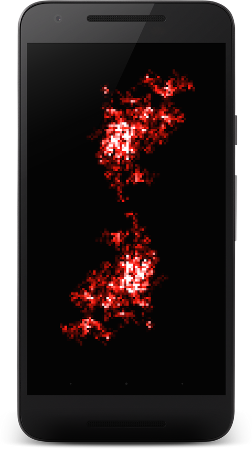

# SoulSeeker
Android app showing a 'smoke like' effect based on you happiness. 

Soul Seeker uses the [Mobile Vision](https://developers.google.com/vision/introduction) library to detect faces and extract the viewers happines.

## What you are looking at on screen
It simulates glowing particles by first calculating the accumalted luminens of the pixels on screen and then mapping them with a color pallet to pixels in a Bitmap object.
The color pallet changes colors constantly by cycling through R,G,B channels.
By using both scaling and bluring using RenderScript it creates a smoke like effect.

The structure that is rendered is created by simulating brownian motion to create a particle structure. The structure is then mirrored and will rotate slowly around its center point.

## What the app is looking at
As soon as it detects a face watching the app through the front camera it will show smoke and colors based on your happiness.
Smiling will change speed and brightness for example. If you are unable to smile or think that looking at pretty graphics is not a laughing matter, ask someone around you to smile for you.

Opening and closing year left or right eye will also influence parts of the smoke and how thick it is. Its hard to explain. Just try it. Also, if you close both eyes at the same time, you will not see the app anymore. This is intentional and no a bug.

## Roadmap

Still to come:
  * Blinking will instantly change the color
  * More settings to tinker with in the Wallpaper and Daydream
  * Presets in the settings for when all the options are a bit overwhelming

Possibly coming:
• OpenGL version.

• Or maybe even Vulken version. I mean, 'Vulkan', it just sounds better, so it must be better as well. Always pick the better sounding technology. It just makes sense.

• An Android Wear watch version. Should not be too hard. We just make it all a bit smaller. Probably by making all the bits and bytes more tiny? That's how it works I think. Or just move all the code further away from me, that usually makes things look smaller.

Definitely not coming:
• Plugins. Specifically those written by owls. You know how they can look at you with those big eyes, and you sort of are unable to say 'no'? Well I practiced. Cardboard cutout of an owl and all. I'm definitely going to say 'no', I'm sure of it....

• The color 'khaki'. I tried though. Can't get it in there. No idea why.

• OK, so, definitely not more than one or two owl plugins. How do they get in here anyway?

## More Info
If you are curious, here is a screenshot of the app running:

You can see it in action here:

[running on several devices](https://youtu.be/zVoKHC7ecvI)

[running as a Daydream with custom settings] (https://youtu.be/LMCs4JYlrJw)
